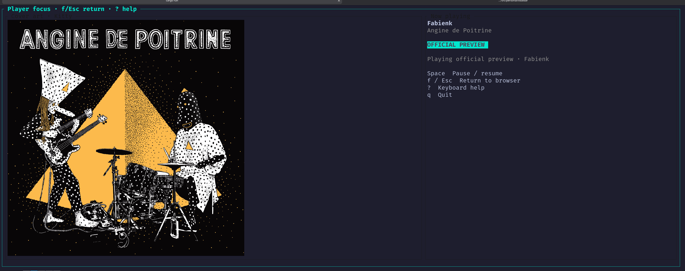
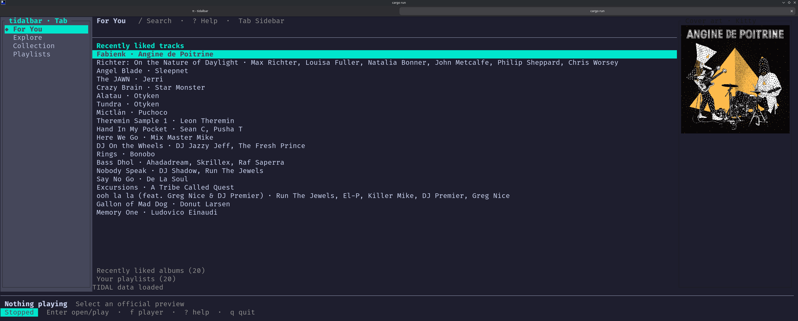

# tidalbar

A keyboard-driven terminal client for [TIDAL](https://tidal.com), built with
Rust and [Ratatui](https://ratatui.rs).

> [!IMPORTANT]
> tidalbar is an independent, early-stage project and is not affiliated with or
> endorsed by TIDAL. Full-track playback uses the undocumented API used by High
> Tide's `tidalapi` dependency. Playback requires a separate login using the
> installed Python `tidalapi` package; TIDAL can change or withdraw this
> unsupported integration without notice. No DRM bypass is implemented.

## Screenshots

These screenshots predate full-track playback and show outdated preview labels;
the current UI displays **Playing** instead.





## Vision

tidalbar aims to combine the exploration depth of TIDAL's web application with
fast keyboard access to liked tracks, albums, artists, playlists, and mixes.
The interface starts at a **For You** screen, keeps playback controls visible,
and adapts from artwork-rich wide terminals to compact text-only sessions.

Planned first-class platforms are Linux and macOS. Windows is supported on a
best-effort basis and included in CI.

## Current status

The initial application shell is usable and includes:

- Responsive For You, Explore, Collection, and Playlists views
- Keyboard navigation and search input
- Automatic Kitty, iTerm2, Sixel, or Unicode half-block artwork selection
- A replaceable media-resolver and audio-engine boundary
- Persistent local playback through `mpv` for unencrypted full-track BTS and DASH
  streams from the unsupported private API (subject to account/API authorization)
- Separate PKCE logins for the official catalog and High Tide-compatible playback,
  with tokens stored in the OS credential store
- Official search, collection, playlist, recommendation-mix, and artwork API
  integration; private full-track playback requests
- Album, artist, and playlist drill-down with back navigation
- Song-list playback with automatic advancement, shuffle, and next-song controls
- A live progress bar with elapsed and total time
- Liking and unliking songs, with a heart in player focus for liked songs
- Configuration in the platform-standard user configuration directory

Placeholder content is shown when tidalbar is not authenticated. Pagination,
queue management, richer recommendation shelves, and other collection mutations
remain under active development.

## Requirements

- Rust 1.88 or newer when building from source
- [`mpv`](https://mpv.io/) available on `PATH`
- A TIDAL subscription for subscriber-only API features
- A TIDAL developer application for catalog API access
- Python 3 with the unofficial `tidalapi` package available to that Python
  interpreter for the separate playback login and token refresh

## Download a binary

Prebuilt binaries are attached to [GitHub releases](https://github.com/feoh/tidalbar/releases/latest):

| Platform | Archive target |
| --- | --- |
| Linux x86-64 (built on Ubuntu 22.04) | `x86_64-unknown-linux-gnu` |
| macOS Apple Silicon | `aarch64-apple-darwin` |
| macOS Intel | `x86_64-apple-darwin` |
| Windows x86-64 | `x86_64-pc-windows-msvc` |

Download `tidalbar-<tag>-<target>.tar.gz` (Linux/macOS) or `.zip` (Windows),
extract it, and place `tidalbar` or `tidalbar.exe` on your `PATH`. Each archive
includes the README and license, with a separate `.sha256` checksum file.
On Linux, verify the download before extracting it with
`sha256sum --check <archive>.sha256`; on macOS use
`shasum -a 256 --check <archive>.sha256`. On Windows, compare
`Get-FileHash <archive> -Algorithm SHA256` with the checksum file.

Rust is not needed to run a binary. **mpv and Python with `tidalapi` are still
separate requirements**; they are not bundled. macOS builds are not Apple-signed
or notarized. Follow the catalog and playback login instructions below after
installing.

The `Release binaries` GitHub Actions workflow builds published releases
from their tagged commits. To attach binaries to an existing release, run it
manually with a version tag, or leave the tag blank to use the latest release:

```console
gh workflow run release.yml -f tag=v0.1.2
```

## Build and run

```console
git clone https://github.com/feoh/tidalbar.git
cd tidalbar
cargo run
```

Force portable text artwork instead of querying terminal image capabilities:

```console
cargo run -- --no-images
```

Inspect the configuration location or authentication state:

```console
cargo run -- config path
cargo run -- config set-client-id YOUR_PUBLIC_CLIENT_ID
cargo run -- config set-redirect-uri http://127.0.0.1:47831/oauth/callback
cargo run -- auth login
cargo run -- auth login-playback
cargo run -- auth status
cargo run -- doctor
```

## Keybindings

| Key | Action |
| --- | --- |
| `?` | Open or close keyboard help |
| `Tab` / `Shift-Tab` | Move focus between the sidebar and content |
| `g` | For You |
| `e` | Explore |
| `c` | Collection |
| `P` | Playlists |
| `/` | Search |
| `j`/`k` or arrows | Move within a shelf |
| `h`/`l` or arrows | Move between shelves |
| `Enter` or `p` | Open albums/artists/playlists or play a track |
| `Backspace` or `Esc` | Return from a detail view |
| `Space` | Pause or resume |
| `s` | Toggle displayed song shuffle (also available in sidebar and player focus) |
| `S` | Start the current song list in random order, enabling shuffle |
| `n` | Play the next queued song |
| `L` | Like or unlike the playing song (or the highlighted song when idle) |
| `f` | Toggle the large-art player focus view |
| `q` | Quit (or close help when help is open) |

### Shuffle and song lists

Open a playlist, album, or artist, or select a shelf of songs such as search
results, liked tracks, or radio results. Press `s` to shuffle the displayed songs,
then `Enter`/`p` to play the highlighted song. The default highlight moves to a
random starting song; a song deliberately selected with navigation remains
highlighted. Playback follows the displayed song order, wrapping to include any
songs above your starting selection. `S` reshuffles the current list and starts
playing immediately.

Only songs from the current shelf are queued; albums and other non-song search
results stay in place and are not queued. New lists also appear shuffled while
shuffle is on. Turning it off restores each list's original order.

Songs advance automatically when playback ends. Shuffle visits each list entry
once, then stops; there is no automatic repeat. With shuffle off, `Enter` plays
from the selected song through the end of the list. Toggling shuffle during
playback keeps the current song and reorders only the remaining queue; when its
source list is visible, that queue follows the displayed shuffle. Turning shuffle
off restores the unplayed songs' original list order. `n` skips to the next queued song. Playback errors stop
automatic advancement; use `n` to skip the failed song.

Browsing, searching, and going back do not change the active queue. Playing
another song or using `S` replaces it. The shuffle setting lasts for the current
application session. Queues include only loaded songs; API pagination is not yet
implemented.

### Liked songs

`L` adds the playing song to your TIDAL **Liked tracks**, or removes it if it is
already liked. When nothing is playing, it uses the highlighted song. Player
focus shows a ♥ next to the title of a liked song.

Liking uses the official `userCollectionTracks` API with the **playback login**,
because the catalog login is limited to read-only scopes. Run
`tidalbar auth login-playback` first. At startup, tidalbar loads your liked
track IDs in the background; until that finishes, `L` likes rather than
unlikes, which is harmless for a song that is already liked.

## Configuration and secrets

The public TIDAL client ID and exact registered redirect URI may be placed in
`config.toml` for official catalog access. Playback uses a **separate** OAuth
session through the installed `tidalapi` package's High Tide-compatible PKCE
flow. Its client identity stays in that external package: tidalbar does not
copy High Tide's saved tokens or distribute its client credentials. Both
sessions' access and refresh tokens are kept separately in the OS credential
store, not in `config.toml`.

Register the same loopback URI in the TIDAL developer dashboard before running
`tidalbar auth login`. The current callback listener accepts HTTP loopback URIs
using `localhost`, `127.0.0.1`, or another loopback IP; it deliberately rejects
remote redirects.

Never commit TIDAL credentials, OAuth tokens, stream URLs, or captured API
responses containing user data. Development credentials may be injected from a
local secret manager such as 1Password.

## Playback policy

Playback is split into two interfaces:

1. A **media resolver** converts catalog entries into authorized playable
   resources.
2. An **audio engine** sends those resources to a persistent `mpv` process.

Authenticated tracks now request `api.tidal.com/v1/tracks/{id}/playbackinfopostpaywall`
with `assetpresentation=FULL` and `audioquality=HIGH` (the default in High
Tide's `tidalapi` dependency). The request uses the separate playback login;
tidalbar gets the session ID and country code from the private `/sessions`
endpoint, as `tidalapi` does, and plays only HTTPS media from unencrypted BTS
or DASH/MPD manifests. It checks that TIDAL actually returned `FULL` rather
than a downgraded `PREVIEW`. Encrypted or unsafe manifests report an error.

This is **not** a supported TIDAL integration. The developer-app OAuth token
previously received `PREVIEW`/`LOW` even when the request asked for `FULL`/`HIGH`;
a successful HTTP response alone did not prove full playback. `tidalbar doctor`
now verifies the returned presentation without printing stream URLs. To set up
playback, install the `tidalapi` package in Python 3, run
`tidalbar auth login-playback`, and complete its browser redirect prompt locally.
The playback login does not change your catalog login. If your default Python
lacks `tidalapi`, install it in a separate environment using `uv` and point
`TIDALBAR_PYTHON` at that environment's Python executable. For example, on
Linux or macOS:

```console
uv venv ~/.local/share/tidalbar/python
uv pip install --python ~/.local/share/tidalbar/python/bin/python 'tidalapi==0.8.8'
export TIDALBAR_PYTHON="$HOME/.local/share/tidalbar/python/bin/python"
tidalbar auth login-playback
```

No DRM workarounds are included, and TIDAL may still reject full playback for
an account or track.

## Development

```console
cargo fmt --all --check
cargo clippy --all-targets --all-features -- -D warnings
cargo test --all-targets --all-features
```

## License

MIT. See [LICENSE](LICENSE).
